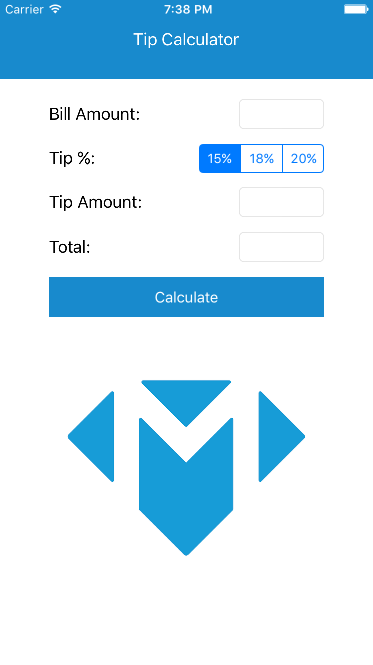

## Tutorial to the Tutorial

This tutorial will walk you through Xcode and its many different features to make a quintessentially "simple" app -- a "Tip Calculator". Every year this endeavor becomes simpler in some ways and more difficult in others. You will learn about using Xcode, building interfaces with _auto-layout_, and how to get an app running on your phone! Also, if you hail from a land that does not tip 15% to 20% at a restaurant, then you'll technically learn a bit about that too!

This tutorial should take you about 2 hours. By the end of the tutorial, you'll have built this:

# Author's Note

This is much more of a tutorial about Xcode then it is about programming. If you have never used an _Integrated Development Environment_ (IDE) before, this will get you acquainted with the minimum required knowledge to be proficient in Xcode, and even give you a taste of some of the more advanced stuff. Many times you may see multiple ways to do the same thing -- repetition is key. Our intent here is to show you as many ways as we can in the short duration of this tutorial.

A builder can only be as good as their tools, and luckily for us, Apple builds their products with _Xcode_ and is continuously improving it! What is the greatest sign of that? During the writing of this tutorial, _Xcode_ crashed exactly 0 times. That is what you need to strive towards when you ship your own apps!

If you ever get stuck on something in Xcode and have the luxury of time, come through this tutorial again. Try to follow all of the steps but none of the instructions. As Steve Jobs said, "the journey is the reward".
