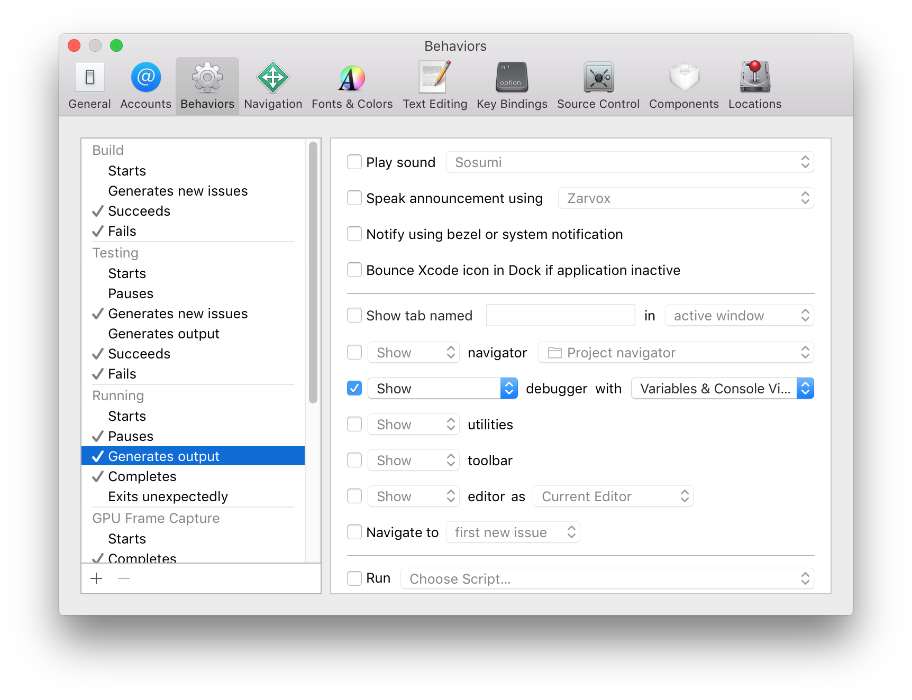
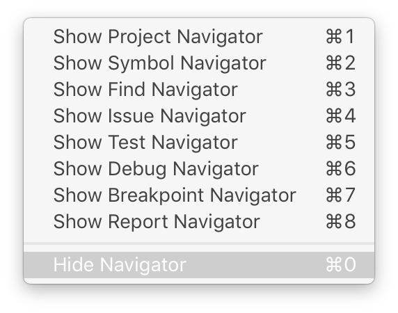
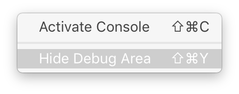
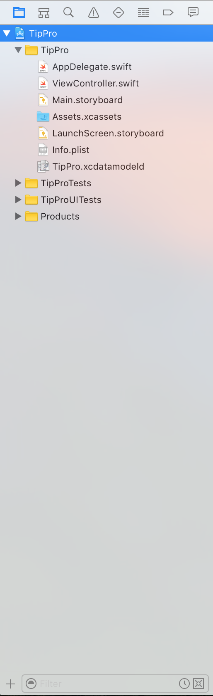

1. Open _Xcode_
1. From the `File` menu, select `New` and then `Project`
1. Under `iOS` select `Application` and then select `Single View Application` and click `Next`
1. Enter `TipPro` for `Product Name`.
1. For `Organization Name` you can enter your name, your fake company name, or `Make School`
1. For `Organization Identifier`, you use a reverse domain name style base for your apps. If you own `supercoolsecretstudios.com` you would put `com.supercoolsecretstudios`. If you don't own a domain name, feel free to put `com.makeschool` for this project.
1. Select `Swift` as the `Language` and `iPhone` as the `Devices`
1. Make sure to select `Use Core Data` from the checkboxes below and for this tutorial, we will leave the other two boxes regarding _tests_ checked.
1. Click `Next` and navigate to the place on your computer where you keep projects. Don't worry about naming the folder or anything like that, _Xcode_ will handle it for you.
1. Keep the `Create Git Repository on My Mac` checkbox selected, and click `Create`
1. Check that your xcode project looks similar to this screenshot.

Can you feel the power? It's ok if you can't. The result on your screen can be very overwhelming at first. Parts of this software such as the _Interface Builder_ date back to 1988, and _Xcode_ itself dates back to something called _Project Builder_ first released in 1992! There is a lot of interesting history around this program you will use to build your apps. Steve Jobs lost control at Apple, built a new company called NeXT, got sued by Apple, and eventually got bought out by Apple and all the hard work of NeXT became the foundation for _Mac OS X_, _iOS_, _tvOS_ and _watchOS_.

It gets even more interesting! When Apple first let 3rd party developers (you) make iOS applications, that rich history was brought to life again. How do you ask? The first iPhone has specs that were much closer to the products released by NeXT in the late 80s and early 90s then the MacBook's of its time. All of the efficiency of UI components that were meant for computers almost 30 years ago, meant that the iPhone felt snappy every time you interacted with it! It may not have felt that way with 2G internet loading full desktop web pages, but once they were loaded, you could pan, zoom, and interact with a web page for the first time with you fingers in a way that felt natural.

As a result, writing apps for the earlier versions of `iOS` meant using manual memory management. Something that developers who are new to `iOS` may never even be exposed to. This is especially the case with writing code in `Swift`. Don't worry though, there are plenty of ways to mess up with automatic memory management too! As you progress through our tutorials, we will highlight memory based issues and teach you how to build your apps to be the best!

The last interesting point we will bring up about Xcode's roots? _XML_ and the _command line_. Every aspect of the _Xcode_ specific parts of your apps code base, are based in XML, and every project action (like building your app) can be done using command line tools included with Xcode. Why is this important? When you want to do something advanced in the future, these will come in handy. When you get a build error in _Xcode_ (that does not exist because of a warning or error), Xcode will make available the exact commands it used to build, and the output of what failed. Hopefully this is something you will not experience in your first year of using _Xcode_, but the first time it happens, remember this paragraph.

As for the power, here we go. _Xcode_ is an _IDE_ or _Integrated Development Environment_. That means it has everything you need to _develop_ _integrated_ into its _environment_. That is why there are so many things on the screen. Other than the _editor_ component located in the center of the window, there are three other sections. Under the `View` menu you can find `Navigators`, `Debug Area`, and `Utilities`. Going forward we will reference these areas as the `Navigation Area`, the `Debug Area`, and the `Utility Area`. These area are referenced Left to Right, where the `Debug Area` is actually under the editor and currently disabled. The first time you run your project, the `Debug Area` might choose to pop up. Let's do that now, and see what happens.

[action]
1. `Run` the project, by clicking the `Play` button on the top left of the project window.
1. The first time you run something with debugging in `Xcode`, you will see a dialog like this, asking for your computer password. This is necessary for debugging.

You should see the `iOS Simulator` launch, and our exciting app (a blank white screen) is there in all of its retina perfection.

But what about our Xcode window. Nothing changed? Hmm. Thats interesting. Here's why. Apple, is notorious for the polish they put into their products. But when you are a developer, you need power. There is a trade-off here, and it makes for an important lesson. The default settings for Xcode will show the debugger as needed. When you are done with it, you have to hide it yourself, but if you are using the screen built into your _MacBook_ and not a larger monitor, all of these things will overwhelm the area where you are actually working. There are multiple ways to do this. One is the `Behaviors` section in the `Preferences`, and the other is manually toggling these sections. If you ever find a time where one of these sections on your screen we are covering in this tutorial changes or pop-up _automatically_ that is considered a _behavior_ of _Xcode_ and can be edited here.

Everything else is manual, and the best way to do that is with keyboard shortcuts. Sure, you can use your mouse and click on the _left_, _bottom_, and _right_ icon representations in the top right of your _Xcode_ window. Sure you can also toggle between sections using the little icons in each section. In fact, this is the way you should start off changing things when you are already using your preferred pointing device. But, when you are typing, you will want to learn the keyboard short cuts to get these things out of the way. When you are focused in code, these things usually get in your way, and are the least productive way to get around, and in many cases have settings, or information that are irrelevant to the task at hand. The choices for these sections are usually numbered, and the number `0` is usually reserved for hiding that section. Debug for some reason, is command-shift-y.

When you are building interfaces on the other hand. The `Utility Area` is basically a hard requirement. And it contains an object browser on the bottom right, which you will use extensively for setting up your interfaces. It is also context sensitive to what you are editing. But we'll get to that shortly.

Lets jump right into the _Navigator_ on the left side. Currently, it should display the _Project Navigator_ which is where you will find files related to your project. If the files are not in here, many components of your app will not be aware of them, even if they are in the same folder! There are ways for more advanced projects to automatically _bundle_ or include files into your app, but for now, anything not in there, should be considered not part of your app. If you do not see something similar to the screenshot below, then you need to select `View -> Navigators -> Show Project Navigator`, click the little folder icon on top of the navigator, or use the keyboard shortcut command-1.

As you progress and work on larger projects, the true power of this `Navigator` will reveal itself. We will continue to discuss navigators, but for now, lets test out that debug area. The default behavior setting said that it would display the debug area if there was some output. So lets make some.
[action]
1. Select `AppDelegate.swift` from the project navigator.
1. Find this block of code:
>
    func application(application: UIApplication, didFinishLaunchingWithOptions launchOptions: [NSObject: AnyObject]?) -> Bool {
      // Override point for customization after application launch.
      return true
    }

1. Add `print("Hello World!")` so that it looks like this:
>
    func application(application: UIApplication, didFinishLaunchingWithOptions launchOptions: [NSObject: AnyObject]?) -> Bool {
      // Override point for customization after application launch.
      print("Hello World!")
      return true
    }

1. Hit `Run` or the `Play` button on the top left.

Once you see the white screen of your app in the simulator, you should see the `Debug Area` popped up, with our _console_ output from the `print` statement. See how its starting to feel a little crowded (if you are on a laptop)? You can hide the debug area now by using the keyboard shortcut, the view menu, the `bottom of the window` button on the top right of the window, or, the little `triangle in a box` icon on the top of the debug area. There are a lot of ways to do even the simplest things in _Xcode_ so keep that in mind as you read tutorials, search for answers, and ask your peers for help. As you gain experience, you may be more productive with shortcuts, but if you have to teach someone else, you may want to start with the long way.

Now its time to dive into the `Utility Area`. Everything in the development world has choices. And when it comes to making iOS apps, we have a choice in how we setup the graphical interface for our app. You can do it _programmatically_ with code or, you can do it graphically using the integrated _Interface Builder_. Yes, this is the tool first released in 1988 and its better than ever! If its so good, why would you want to do it any other way? Thats a great question. Usually when you have more than one person working on an app, it is impossible to merge changes made to these interface files. Also, in the past, this tool did not provide much extra utility over writing your interfaces in code. But as time progressed, new iPhones came out with different screen sizes, and Apple introduced Auto-Layout. No, its not fully automatic, but if you are a solo developer, you need these tools to build apps that work seamlessly on different sized devices. They are also available in code, but we are going to get started with them graphically. We have a `Single View Application` so this is going to be as simple as it can get.

[action]
1. Select `Main.storyboard` from the project navigator.

Bask in its glory! In the `Utility Area` you can see `No Selection` prominently displayed where all the utilities should be, and some choices underneath in the `Object Browser`. Let's keep rolling.
