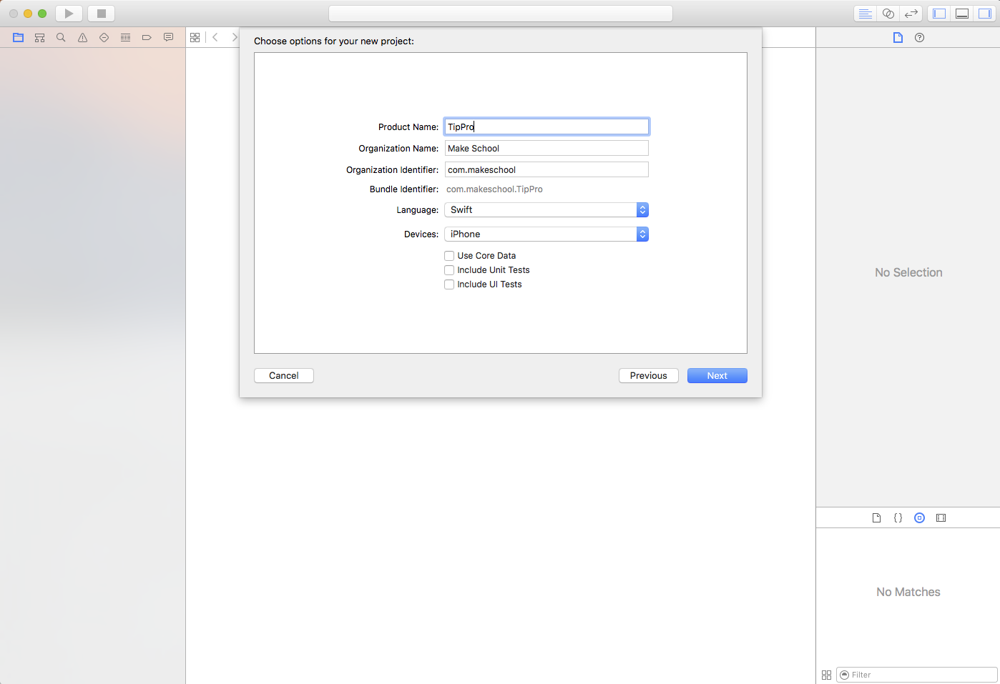
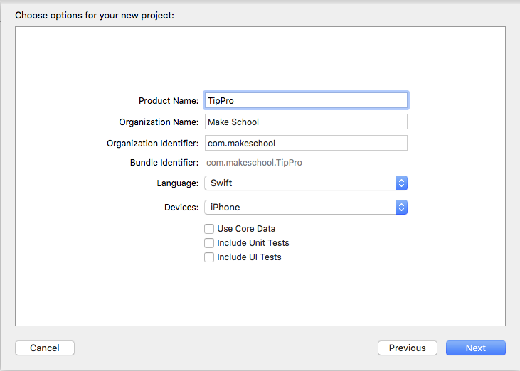
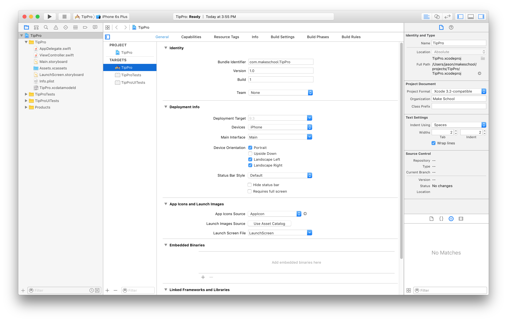
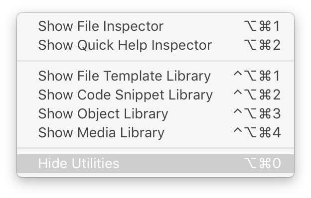

## Creating a project

> [action]
>
1. Open _Xcode_
1. From the `File` menu, select `New` and then `Project`
1. Under `iOS`, within the `Application` section, select `Single View Application`, and click `Next` 
1. Enter `TipPro` for `Product Name`.
1. For `Team`, you can select your Apple Developer Team if you have one, or simply leave it as `None`.
1. For `Organization Name`, you can enter your name, your fake company name, or `Make School`.
1. For `Organization Identifier`, you use a reverse domain name style base for your apps. If you own `supercoolsecretstudios.com` you would put `com.supercoolsecretstudios`. If you don't own a domain name, feel free to put `com.makeschool` for this project.
1. Select `Swift` as the `Language` and `iPhone` as the `Devices`.
1. Leave `Use Core Data` and the other two boxes regarding _tests_ unchecked 
1. Click `Next` and navigate to the place on your computer where you keep projects. Don't worry about naming the folder or anything like that, _Xcode_ will handle it for you.
1. Keep the `Create Git Repository on My Mac` checkbox selected, and click `Create`
1. Check that your Xcode project looks similar to this screenshot 

Can you feel the power? It is okay if you can't. The result on your screen can be very overwhelming at first. Parts of this software such as the _Interface Builder_ date back to 1988, and _Xcode_ itself dates back to something called _Project Builder_ -- first released in 1992! There is a lot of interesting history around Xcode.

# A brief history lesson

In 1985, Steve Jobs lost control at Apple and built a new company called NeXT. Initially, Jobs was sued by Apple; however, NeXT was eventually acquired by Apple in 1997. All the hard work of NeXT became the foundation for _Mac OS X_, _iOS_, _tvOS_, and _watchOS_.

It gets even more interesting! When Apple first let 3rd party developers (you) make iOS applications, that rich history was brought to life once again. How? The original iPhone, introduced in 2007, had specs that were much closer to the products released by NeXT in the late 80s and early 90s than the MacBooks of its time. All of the efficiency of UI components that were meant for computers almost 30 years ago, meant that the iPhone felt snappy every time you interacted with it! It may not have felt that way with 2G internet attempting to load full desktop web pages, but, once they were loaded, things were buttery smooth. You could pan, zoom, and interact with a web page with your fingers for the first time in a natural and responsive way.

As a result, writing apps for the earlier versions of `iOS` meant using manual memory management -- something that new iOS may never have to do. This is especially the case with `Swift`, which provides automatic memory management. Don't worry though, there are plenty of ways to mess up with automatic memory management too! As you progress through our tutorials, we will highlight memory based issues and teach you how to build your apps to be the best!

The last interesting point we will bring up about Xcode's roots are _XML_ and the _command line_. The _Xcode_-specific parts of your app's code base are based in XML, and every project action (like building your app) can be done using command line tools included with Xcode. Why is this important? Well, when you want to do something advanced in the future, these tools will come in handy. When you get a build error in _Xcode_, Xcode will make available the exact commands it used to build your project, including the output of what failed. Hopefully, this is something you will not experience in your first year of using _Xcode_ (a build error, as opposed to a compilation error, which you'll have plenty of) but the first time it happens, remember this paragraph.

# Exploring Xcode

As for the power, here we go. _Xcode_ is an _IDE_ or _Integrated Development Environment_. This means it has everything you need to _develop_ _integrated_ into its _environment_. That is why there are so many things on the screen.

Other than the _editor_ component, located in the center of the window, there are three other sections. Under the `View` menu you can find `Navigators`, `Debug Area`, and `Utilities`. Moving forward, we will reference these areas as the `Navigator Area`, the `Debug Area`, and the `Utility Area`. These areas are referenced Left to Right, where the `Debug Area` is actually under the editor and currently disabled. The first time you run your project, the `Debug Area` might choose to pop up. Let's do that now, and see what happens.

> [action]
>
1. `Run` the project by clicking the `Play` button on the top left of the project window.
1. The first time you run something with debugging in `Xcode`, you will see a dialog like this, asking for your computer password. This is necessary for debugging. 

You should see the `iOS Simulator` launch, and our exciting app (a blank white screen) is there in all of its retina perfection.

But what about our Xcode window. Nothing changed? Hmm. Thats interesting. Here's why: Apple is notorious for the polish they put into their products. But when you are a developer, you need power. There is a trade-off here, and it makes for an important lesson. The default settings for Xcode will show the debugger as needed. When you are done with it, you have to hide it yourself, but if you are using the screen built into your _MacBook_ and not a larger monitor, all of these things will overwhelm the area where you are actually working. There are multiple ways to do this. One is the `Behaviors` section in the `Preferences`, and the other is manually toggling these sections. If you ever find a time where one of the sections, covered in this tutorial, changes or pops-up _automatically_, that is considered a _behavior_ of _Xcode_ and can be edited by opening the Preferences menu -> Behaviors -> Running -> Generates Output.


# Overview of the areas


## Navigator Area

Let's jump right into the _Navigator_ on the left side. Currently, it should display the _Project Navigator_ which is where you will find files related to your project. If the files are not in here, then your app will not be able to use them. It doesn't matter if they are in the same folder as other included files, Xcode manages its own files so they must show up in the _Project Navigator_!

## Utility Area

The `Utility Area` on the right side is essential when you are building interfaces. It contains an object browser on the bottom right, which you will use extensively for setting up your interfaces. It is also context sensitive to what you are editing. But we'll get to that shortly.

> [info]
>
There are ways for more advanced projects to automatically _bundle_ or include files into your app, but for now, anything not in there, should be considered not part of your app. If you do not see something similar to the screenshot below, then you need to select `View -> Navigators -> Show Project Navigator`, click the little folder icon on top of the navigator, or use the keyboard shortcut `command-1`.


As you progress and work on larger projects, the true power of the `Navigator Area` will reveal itself. We will continue to discuss navigators, but for now, let's test out the `Debug Area`. The default behavior setting said that it would display the `Debug Area` if there was some output. So let's output something!

## Debug Area

> [action]
>
Select `AppDelegate.swift` from the project navigator. Find this block of code:
>
```
func application(_ application: UIApplication, didFinishLaunchingWithOptions launchOptions: [NSObject: AnyObject]?) -> Bool {
  // Override point for customization after application launch.
  return true
}
```
>
> Add `print("Hello Make School!")` so that it looks like this:
>
```
func application(_ application: UIApplication, didFinishLaunchingWithOptions launchOptions: [NSObject: AnyObject]?) -> Bool {
  // Override point for customization after application launch.
  print("Hello Make School!")
  return true
}
```
>
Hit `Run` or the `Play` button on the top left.

Once you see the white screen of your app in the simulator, you should see the `Debug Area` pop up, with our _console_ output from the `print` statement.


See how it's starting to feel a little crowded (especially if you are on a laptop)? You can hide the debug area now by using the keyboard shortcut, the view menu, the `bottom of the window` button on the top right of the window, or, the little `triangle in a box` icon on the top of the debug area.

There are a lot of ways to do even the simplest things in _Xcode_. Keep this in mind as you read tutorials, search for answers, and ask your peers for help. As you gain experience, you may be more productive with shortcuts, but when you're teaching someone else, you may want to start with the long way.

# Hiding and showing parts of the interface

Everything else is controlled manually and the best way to do that is with keyboard shortcuts. Of course, you can also use your mouse and click on the _left_, _bottom_, and _right_ icon representations in the top right of your _Xcode_ window. 

> [info]
>
Sure, you can also toggle between sections using the little icons in each section. In fact, this is the way you should start off changing things when you are already using your preferred pointing device (mouse, trackpad, etc). But, when you are typing, you will want to learn the keyboard shortcuts to get these things out of the way. When you are focused in code, these things usually get in your way, and are the least productive way to get around; and, in many cases, have settings or information that are irrelevant to the task at hand. The choices for these sections are usually numbered and the number `0` is usually reserved for hiding that section.
>

>

>
Hiding the debug area is a bit different, its shortcut is `command-shift-y`.
>

