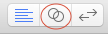

Now its time to dive into the `Utility Area`. Everything in the development world has choices. When it comes to making iOS apps, we have a choice in how we setup the graphical interface for our app. You can do it _programmatically_ with code or, you can do it graphically using the integrated _Interface Builder_. Yes, this is the tool first released in 1988 and its better than ever!

> [info]
If it's so good, why would you want to do it any other way? Thats a great question. Usually when you have more than one person working on an app, it is impossible to merge changes made to these interface files. Also, in the past, this tool did not provide much extra utility over writing your interfaces in code. But as time progressed, new iPhones came out with different screen sizes, and Apple introduced Auto-Layout. No, its not fully automatic, but if you are a solo developer, you need these tools to build apps that work seamlessly on different sized devices. They are also available in code, but we are going to get started with them graphically. We have a `Single View Application` so this is going to be as simple as it can get.

<!--  -->

>[action]
> ## Opening the storyboard
>
Select `Main.storyboard` from the project navigator.
>

Bask in its glory! In the `Utility Area` you can see a few attribute settings for the Storyboard, and some choices underneath in the `Object Browser`. Let's keep rolling.

# Adding a label

>[action]
> ## Adding a label
>
1. On the bottom right of the screen, in the `Object Browser`, scroll until you find `Label`
1. Click and drag the `Label` into the white square in the middle of the screen. You might need to zoom into the Storyboard if it won't let you drag the label in (pinch out on the trackpad or click the main area and press `command and +`)
>

Currently you are in the `Attributes Inspector` part of the `Utility Area`. In this area, you will see all the _Attributes_ of the `UILabel`. In code, these are the external _properties_ that you can set on a `UILabel` object. If you are planning to change those attributes dynamically, you will have to do that in code. But if you are going to set them once, including certain automatic/dynamic settings, you can do that here. Let's jump right in.

>[action]
> ## Changing the label's text
>
> In the `Attributes Inspector` change the `Text` value from `Label` to `Tip Calculator` 

Uh oh. The label is too small to display the full text. We could use the little resizing squares to make it the right size, or even the aptly named `Size Inspector` to change its size. But we are going to use this opportunity to get started with the most powerful part of `Interface Builder` that developers would have killed for back in 1988.

# Constraints and Auto-Layout

`Constraints` are an important part of a system called `Auto-Layout` that we can use to design our interface once, and have it automatically adjust to different screen sizes. It doesn't stop there, it can help if you want to support rotating the device and even other languages.

>[action]
> ## Fixing the label alignment
> Watch the video and follow the steps below:
>
1. With the label selected, click the _Pin_ button on the bottom of the storyboard window.
1. Add _constraints_ of 20 to the top, left, and right, save the constraints.
1. Click the _Resolve Auto-Layout Issues_ button (next to the _Pin_ button) and _Update Frames_.
1. Center the text horizontally in the label from the _Attributes Inspector_.
>
> 

Let's quickly review what we did there. We added `constraints` to the label, so that its size will be set automatically. We told the label that it should sit 20 pixels from the top, 20 pixels from the left, and 20 from the right. These are not magic numbers, and as you progress, you will get a better idea for how things should look on the screen of a handheld device. Apple has so many thoughts on the subject, that they publish _Human Interface Guidelines_ that you can follow the rules they propose for all _user interfaces_ that you design. Also, in the future you will probably work with designers who will spend large amounts of time thinking about how things should look, and then you can translate their design into the right values for the interface. For now, we have selected `20`.

Next, we are going to need some place for the user to put in the amount of the bill.

# Adding a bill amount label

>[action]
> Watch the video and follow the steps below:
>
1. Type label in the the object browser filter box.
1. Drag label to the view.
1. Change label text to `Bill Amount:`.
1. Right-click and drag from label to view. select `center horizontally`.
1. Choose the `size inspector`.
1. Change the `align center x to` to `-50` (make sure to hit `-` twice).
1. Right-click and drag from the label to the `Tip Calculator` label and select `Top`.
1. Change the `Align Top To: Tip Calculator` to `50`.
1. Click on the label again and `update frame`.
1. Clear and type field in the the object browser filter box.
1. Drag textfield to the view.
1. Right-click and drag from textfield to view. select `center horizontally`.
1. Change the `align center x` to 50.
1. Right-click and drag from the label to the `Tip Calculator` label and select `Top`.
1. Change the `Align Top To: Tip Calculator` to `50`.
1. Right-click and drag from the label to the `Bill Amount` label and select `Equal Heights`.
1. Pin the `width` to `75`
>
> 

# Adding a tip percent label

Okay, take a deep breath and get ready to do it again.

>[action]
> Watch the video and follow the steps below:
>
1. Option-click and drag the `Bill Amount:` label down a little bit.
1. Double-click the new `Bill Amount:` label and change text to `Tip %:` and then hit enter.
1. Clear object browser filter and type in `segment`.
1. Drag segmented control.
1. Select `Attributes Inspector`.
1. Increase number of segments to `3`.
1. Double click `First` and change to `15%`.
1. Double click `Second` and change to `18%`.
1. Double click ` ` (the empty third one) and change to `20%`.
>
> 

# Checking out our work

Great! We have a few labels now... Let's see how they look in the simulator.

>[action]
>
> Run the app and rotate the simulator to see how things move around when they are not set up with the proper pinning.
>
You can rotate the simulator with `command + left/right arrow keys` or from the `Hardware menu -> Rotate Right / Left`.

Things are moving everywhere! Time to fix that.

>[action]
> ## Fixing it automatically?
>
1. Click the `Segmented Control` and click `Add Missing Constraints` from the _Resolve Auto-Layout Issues_ menu.
1. Click the `Tip %:` and click `Add Missing Constraints`.
1. Run the app and see how everything is messed up now. Rotate to see again how its messed up there as well. Rotate back to see how its consistent at being messed up.

Well that did not work. Let's undo it!

>[action]
> ## Undoing the auto-constraints
> Watch the video and follow the steps below:
>
1. Use shift to select all the `Tip %:` and `15% 18%` constraints. And then hit delete to delete them.
1. Right-click and drag from `Tip %:` to `Bill Amount:`. Select `Leading`.
1. Right-click and drag from the `Segmented Control` to the `Text Field` select `Trailing`.
1. Click the _Resolve Auto-Layout Issues_ button and _Update Frames_.
>
> 

Why did they do that? This is programming. In programming, the device does exactly what you tell it to. Nothing more, and nothing less. Most of the time, when something seems unexpected, you will feel like the device actually did more or less than it was asked. Almost every single time, that is not the case. It's user error.

Now, you may not have been the user that made the error. But since you have built on top of someone else's error, it is your problem now. If this error proves to be critical, you will have to _work-around_ it, file a bug report, or maybe even fix it yourself. But we're not talking about low-level components of the operating system here, or even Xcode. We are talking about _auto-layout_!

So how do we fix it? More constraints! Keep in mind that these constraints actually boil down to code that gets executed on the target device. So remember, it may feel like using _Microsoft Word_ or _Google Docs_ or even _Pages_ but its actually writing XML in a DSL (_Domain Specific Language_) that has a clear path to code being run. If you don't believe me, hover over the text alignment with a label selected and bask in the glory of the Objective-C message equivalent that will actually get run on your users devices. 

# Fixing the spacing

>[action]
> Watch the video and follow the steps below:
>
1. Right-click and drag from `Tip %:` to the `Bill Amount` label and select `Top`.
1. Change the `Align Top To: Bill Amount` to `50`.
1. Click on the label again and `update frame`.
1. Right-click and drag from from the `Segmented Control` to the `Text Field` and select `Top`.
1. Change the `Align Top To: Round Style...` to `50`.
1. Click on the label again and click the _Resolve Auto-Layout Issues_ button, _Update Frames_.
>
> 

# Fixing the centering

> [action]
> Watch the video and follow the steps below:
>
1. Control-click (or right-click) and drag from the tip selector to the `tip %` label and choose center vertically.
1. Click the _Resolve Auto-Layout Issues_ button and _Update Frames_.
>
> 
>
Run the app and see how everything is looks much more consistent. Rotate it to see again how stays consistent. Rotate it back to see how it's still correct!

# Easier previewing

We have previewing our UI by running the app. Which can get annoying if you are working somewhere deep in the app, and want to test it out on multiple devices. You can use the `Assistant Editor` to display a preview of the screen you are working on across multiple devices.

>[action]
>
1. Click on the linked rings/venn diagram (needs screenshot) to open the `Assistant Editor`. 
1. Set it to preview (with screenshot).
1. Click on the `+` icon on the bottom left of the preview area to add an extra device. Select 'iPhone 5.5 inch'.
1. Click on the `+` icon on the bottom left of the preview area to add an extra device. Select 'iPhone 4 inch'.
1. Close the `Navigation Area` [screenshot for button] to make more space. (or command-0).
1. Drag the divider between the `editors` to make more space.

Now you should have some sample devices without having to launch your code. This is not a perfect solution and may not work when using custom controls you download from the internet or create yourself in the future. There are ways now to make this work with these custom controls, but they may not be worth the tradeoff in time. For now, we decided to have two `iPhone 4 inch` devices so that you can see landscape mode at the same time.

# Adding the final controls

>[action]
> Watch the video and follow the steps below:
>
1. Option-click and drag the `Tip %:` label down a little bit.
1. Double-click the new `Tip %:` label and change text to `Tip Amount:` and then hit enter.
1. Option-click and drag the `Tip Amount:` label down a little bit.
1. Double-click the new `Tip Amount:` label and change text to `Total Amount:` and then hit enter.
1. Right-click and drag from `Tip Amount:` to the `Tip %` label and select `Top`.
1. Right-click and drag from `Tip Amount:` to the `Tip %` label and select `Leading`.
1. Change the `Align Top To: Tip %` to `50`.
1. Right-click and drag from `Total Amount:` to the `Tip Amount` label and select `Top`.
1. Right-click and drag from `Total Amount:` to the `Tip Amount` label and select `Leading`.
1. Change the `Align Top To: Tip Amount` to `50`.
1. Option-click and drag the text field next to the `Bill Amount` label down to line up with the `Tip Amount Label`.
1. Right-click and drag from the new text field to the view. select `center horizontally`.
1. Change the `align center x to` to `50`.
1. Right-click and drag from the new text field to the `Tip Amount` label and select `Equal Heights`.
1. Option-click and drag the new text field next to the `Tip Amount` label down to line up with the `Total Amount Label`.
1. Right-click and drag from the new text field to the view. select `center horizontally`.
1. Change the `align center x to` to `50`.
1. Right-click and drag from the new text field to the `Total Amount` label and select `Equal Heights`.
>
> 
