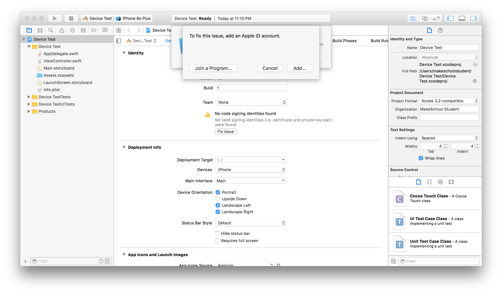
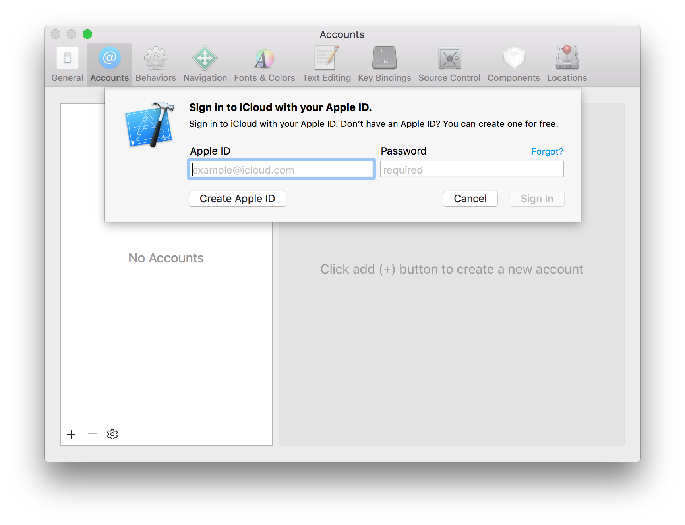
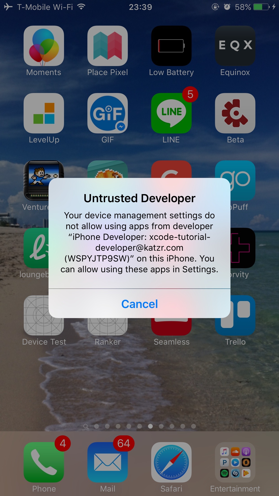
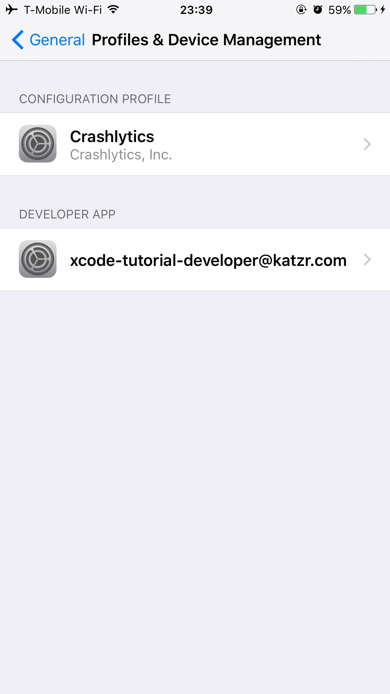
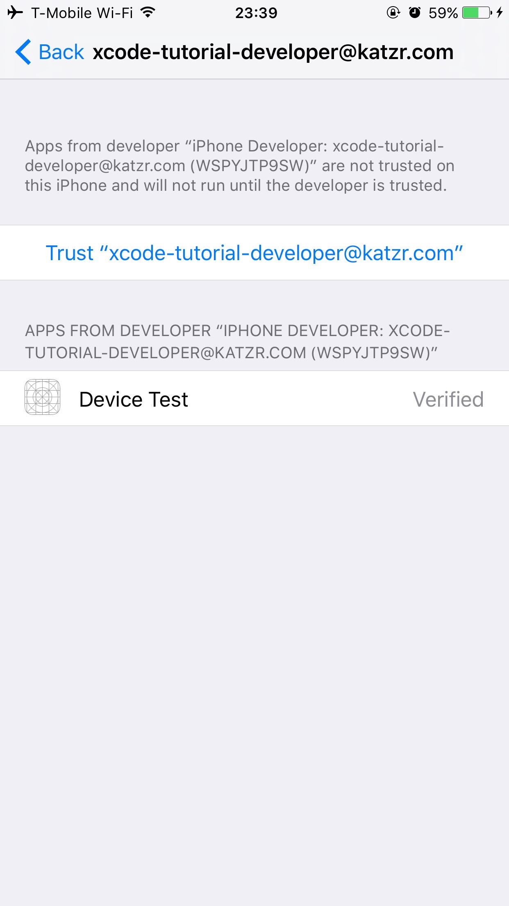

Running your code on your device used to be a complicated process that required a paid membership to Apple's Developer Portal. But now, it is literally one click! (With a lot of extra clicks).

>[action]
>
1. Plug your iOS device into your Mac using a lightning cable.
1. Unlock your phone and click "trust" if prompted.
1. On the top left section of the _Xcode_ window where it says `iPhone 6S Plus` (or something similar), select your device from the drop down menu. (If it says your device is unavailable because of the version, lower the `Deployment Target` in the project settings).
1. Click the `Run` button on the top left. It will tell you that there is no team selected, and that you need a team to run on the device. 
1. Let _Xcode_ fix this issue for you by logging in with your `Apple ID` or `iCloud` account. This is the same you use to download apps in the _App Store_. If you do not have an `Apple ID` _Xcode_ will let you create one, and follow the onscreen steps in order to do so. 
1. Click the `Run` button again.
>You may get an error that the device is not available yet because it is processing symbols. If so, there will be a progress bar you can watch while you wait. Then you can run it again. 

But wait! Thats not all! Apple is very serious about security, and when you `side-load` apps, they have not been screened in the same way ones from the _App Store_ have, so you have to Trust the profile that _Xcode_ just created for you that lets you run apps on your phone.

>[action]
>
1. On your iPhone, open `Settings` and then `General` and then `Profiles and Device Management` 
1. Select your `Apple ID`
1. Click `Trust <your Apple ID>` 
1. Click `Trust` again.

Great! Now you should be able to run the app. Try hitting the run button in _Xcode_ again! If you want to run it in the simulator later, you can select the simulator in the same way you selected your device earlier!
