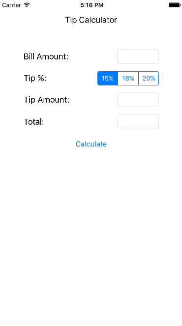

We are going to be using `Stack views` to make our layout easier. Stack views are used to align elements vertically or horizontally. Each pair of `label` and `text field / segmented control` will be added to a horizontal stack view. All these "rows" and the `button` will then be added to a single vertical stack view.

By the end of this page, we'll have our full interface finished and it will work on all screen sizes!

# Creating stack view rows

Let's go ahead and get each pair of elements combined into horizontal stack views. These will become the rows of our vertical stack view.

>[action]
> Watch the video and follow the steps below:
>
1. Click on the first `label` to select it. Hold `shift` and click on the `text field` to its right.
1. Click the `stack` button (rectangles with down arrow, near pin button) to combine them in a horizontal stack view. You should see them squish together and form one unit.
1. Repeat for the other three `label` and `text field/segmented control` pairs.
>
> 

# Creating the super stack view

Now that we have rows, let's combine them into a single, vertical stack view. This will be easier to do from the left side, layout tree navigator on the left. Watch the video first!

>[action]
> Watch the video and follow the steps below:
>
1. Notice how it is hard to click and select the stack view itself.
1. Click the first stack view from the left side layout tree navigator panel.
1. Hold `command` while clicking each other `stack view` and the `button` so they are all selected.
1. Press the `stack` button to combine them all into a single, vertical stack view.
>
> 

# Organizing our layout tree

Before we move any further, let's organize our layout tree and update our labels to display the correct information!

>[action]
> Watch the video and follow the steps below:
>
1. Expand the tree in the left side layout tree navigator (as seen in the video).
1. Click once to select the root stack view, pause, click again to edit its name. Enter `Super Stack View`. From now on, we'll refer to this process as "rename the element".
1. Rename the first horizontal stack view to `Bill Amount Stack View`.
1. Select the first label and change its text to `Bill Amount:` from the attribute inspector.
1. Rename the first text field to `Bill Amount Text Field`
1. Rename the second horizontal stack view to `Tip % Stack View`, change its label's text to `Tip %:`, and rename its segmented controller to `Tip % Segmented Controller`.
1. Rename the third horizontal stack view to `Tip Amount Stack View`, change its label's text to `Tip Amount:`, and rename its text field to `Tip Amount Text Field`.
1. Rename the fourth horizontal stack view to `Total Stack View`, change its label's text to `Total:`, and rename its text field to `Total Text Field`.
1. Select the button and change its title to `Calculate` from the attribute inspector.
>
> 

There we go! Isn't that much cleaner?

# Add spacing to super stack view

Things are a bit crammed together. Let's add some spacing!

>[action]
> Watch the video and follow the steps below:
>
1. Select super stack view from the layout tree.
1. Change its `alignment` to `center` in the  `Attributes Inspector`.
1. Change `spacing` to `15` in the  `Attributes Inspector`.
>
> 

# Constraining super stack view

It's finally time to make this stack view full-screen! We'll be adding constraints to it similar to what we did with the Tip Calculator label that became our title bar.

>[action]
> Watch the video and follow the steps below:
>
1. Select super stack view from the layout tree and open the `pin` menu.
1. Activate the `left`, `top`, and `right` constraints. Set the `left` and `right` to `50`. Set the `top` to `20`.
1. Click the `Resolve Auto-Layout Issues` button and `Update frames`.
1. Run the simulator and see how nice it looks! Rotate it and notice how it still is centered. We're getting close to a our final interface!
>
> 

Looking good!

# Constraining the "rows"

Do you see how the `label` and element pairs are still squished together? Let's add a few more constraints to make them take up the full size of the super stack view! Note, this video already has `15%`, `18%` and `20%` in the segmented controller! We'll be doing that step soon...

>[action]
> Watch the video and follow the steps below:
>
1. Close the stack view rows in the layout tree to make this a bit easier.
1. Select `Bill Amount Stack View`, control-click (or right-click) drag from the `Bill Amount Stack View` to the `Super Stack View` and, in the menu that appears, select `Equal Widths`. This will ensure that the row is always the same width as the `Super Stack View`.
1. Repeat this process for each other stack view row and the `Calculate` button.
>
> 

# Setting the segment values

The last piece of the puzzle is setting the values for each segment in the segmented control!

>[action]
> Watch the video and follow the steps below:
>
1. Select the segmented controller (Tip Selector) from the layout tree.
1. Modify the values of each segment to `15%`, `18%` and `20%` respectively.
>
> 

Finally! We have a basic interface and it looks correct on all devices! Ready to get it running on your iPhone?
