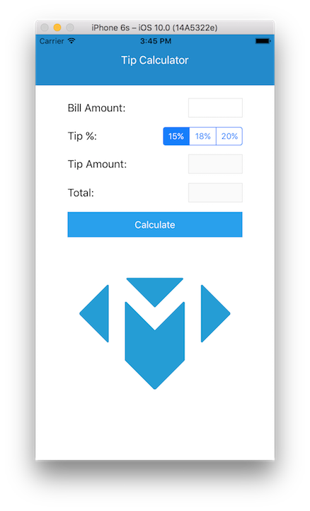
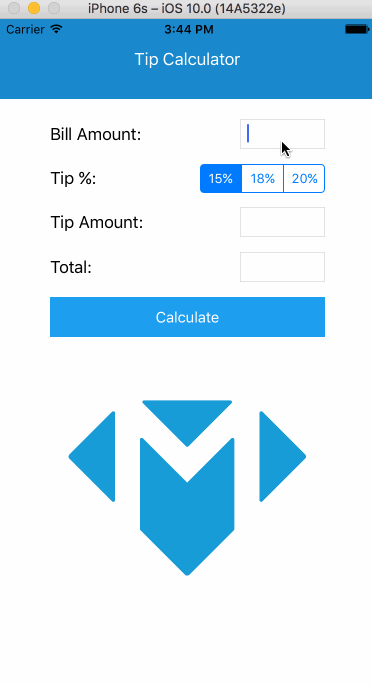

# Tip Calculator

## What you will learn

Throughout this tutorial, you will be introduced to the IDE for iOS
development known as Xcode. Additionally, this tutorial introduces you to Auto
Layout, a tool used to dynamically position all of the views within your app.
Auto Layout is a very powerful tool and is explored in more depth in further
tutorials. Furthermore, you will familiarize yourself with special view elements
such as Stack Views and how you can better organize various subviews. Finally,
you'll be introduced to the national phenomenon of tipping 15, 18, or 20% at
restaurants.

## Common issues

Here are a few questions that our students have had about this tutorial:
<dl>
  <dt>I have set up the constraints for my views but they aren't reflected in the
storyboard. Did I do something wrong?</dt>
  <dd>Not at all! You simply need to update your views in the storyboard by
  clicking the <b>Resolve Auto Layout Issues</b> pin (the tie fighter with a
    triangle in the middle) and clicking <b>Update Frames</b> under <b>All Views in
    View Controller</b>. Once you do this, all of your views will adjust to reflect
    your current constraints. If your views are still not where you want them to
    be, you need to look into your constraints and adjust them appropriately.
  </dd>
</dl>

## What you should understand when finished
After completing this tutorial, you should be able to answer the following
questions:
* What are the 4 main areas of Xcode?
* How do you horizontally center a subview within its parent view?
* How would you ensure that a subview always takes up the full width of the
screen?
* How would you set up a segment controller to perform different actions based
on the selected segment?
* How do you hook up a view element to an action you have defined
programmatically?
* What is a stack view and when would you use it?
